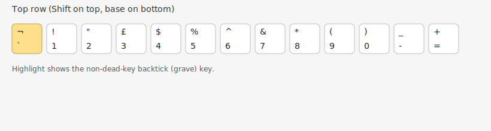

# Irish (English Ireland) Keyboard Layout — No Dead-Key Backtick

Custom Windows keyboard layout based on the Irish (English Ireland) layout. It disables the default dead-key behavior for the backtick/grave key so the ` character types immediately, while keeping the Irish accented vowel mappings intact.

Built with [Microsoft Keyboard Layout Creator (MSKLC) 1.4](https://www.microsoft.com/en-us/download/details.aspx?id=102134). The layout name is **Irish - Custom**, locale **en-IE**, version **1.0**.

## Features
- Backtick/grave key outputs a literal ` (no dead key).
- Preserves Irish accented vowels on AltGr (e.g., á, é, í, ó, ú).
- Prebuilt Windows installers included for common architectures.

## Usage / Key mapping

- ` key (above Tab, left of 1): types ` immediately (no dead key).
- Shift+` : types ¬ (not sign).
- AltGr (Right Alt or Ctrl+Alt) + vowel: á, é, í, ó, ú, ý.
- Shift+AltGr + vowel: Á, É, Í, Ó, Ú, Ý.

## Repo contents
- `msklc_custom_ie.klc` — MSKLC source layout file.
- `assets/keyboard-layout.svg` — Small layout preview image (top row).
- `installation/` — Generated installer artifacts:
  - `setup.exe`
  - `IECustom_amd64.msi`
  - `IECustom_i386.msi`
  - `IECustom_ia64.msi`
  - `installation/*/IECustom.dll`

## Install
1. Run `installation/setup.exe` or the MSI that matches your architecture.
2. Add **Irish - Custom** in Windows Language settings (Time & language → Language & region → Keyboards).

## Build or customize
1. Open `msklc_custom_ie.klc` in MSKLC 1.4.
2. Make changes as needed.
3. Use **Project → Build DLL and Setup Package** to regenerate installers.
